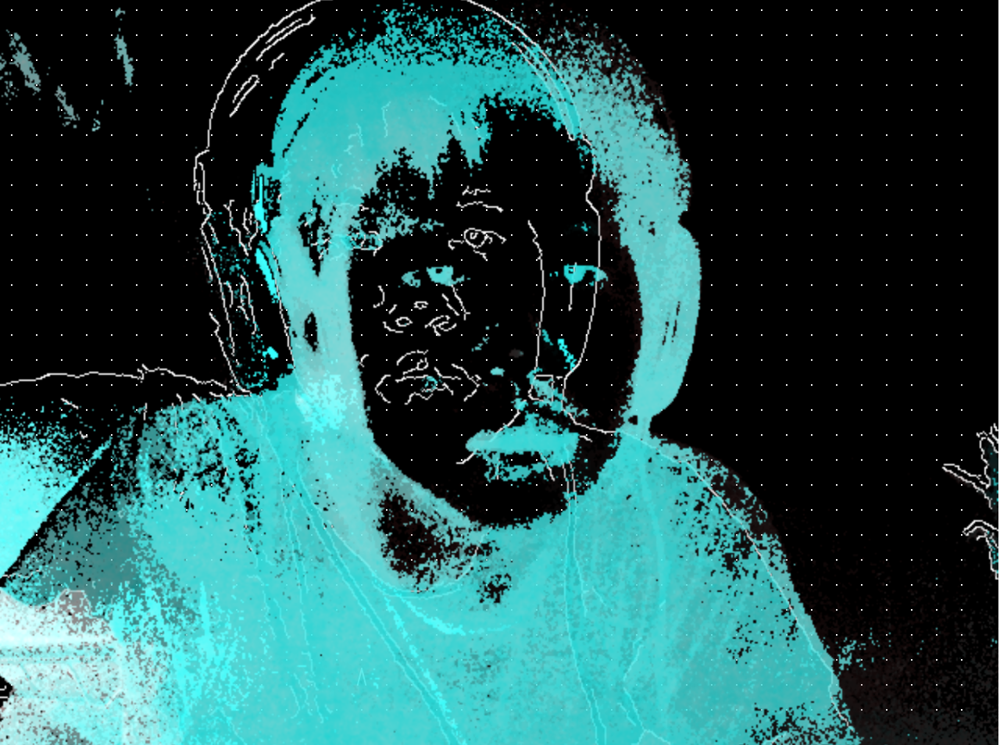

I set up my project combining both of Motion History and the Edge Detection to create the effect of painting yourself. 
I basically combine both of the code together and change the color of the Motion History from gray scale to blue. I changed the font style of the html using CSS. 
The challenges are that I don't really have full understanding of some codes. But I was able to spot the difference and combine two sketch.js
file together to create this effect. If possible I would want to change the color of the motion history with the speed changes.

